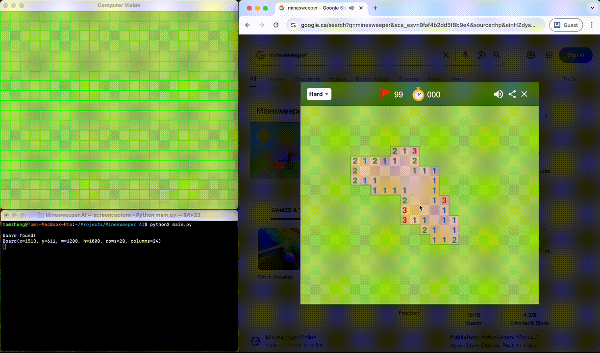

# Minesweeper AI
An AI that solves Google's Minesweeper  
It takes a screenshot of your screen, processes the image, finds where the mines are, and sends click signals to your computer

> **Demo:**  
> See the animation below for a demonstration of the AI solving Minesweeper in real time.



## How to use
```
git clone https://github.com/TomZhang11/Minesweeper-AI.git
cd Minesweeper-AI
pip install -r requirements.txt
python main.py
```
> **Note:**  
> You may need to allow certain system permissions (such as screenshot and mouse control) for the program to run

## Libraries used
- OpenCV for image processing
- PyAutoGUI for sending click signals

## Implementation

**Image processing:** The AI uses `findContours` to find the board with area within a preset range. The color of the center pixel on each cell is used to determine its state and number.

**Solving:** In each loop iteration, the AI uses 3 algorithms to solve the game. The first 2 are used for efficiency reasons, but they cannot handle all cases. The 3rd algorithm uses constraint search to handle more complex cases that the first 2 algorithms cannot handle.

See `src/algorithms/solver.py` to learn more about the algorithms.

## Design

This project is designed with object-oriented programming principles

Key components include:
- **Error Handling Classes:** Custom exceptions are used throughout the codebase to handle abnormal situations gracefully.
- **Logging Class:** A dedicated logger provides detailed runtime information, making debugging and analysis easier.
- **Settings Class:** Centralized configuration management allows for easy adjustment of parameters and behaviors.

The architecture follows a Model-View-Controller (MVC) pattern:
- **Model:** Represents the game state, including the board and cells.
- **View:** Handles image processing and visualization, interpreting the Minesweeper board from screenshots.
- **Controller:** Manages the AI logic, decision-making, and user interactions.

This structure makes the codebase extensible and easy to understand

## Limitations

- The program only works on Google's Minesweeper.
- The project was develped and tested on a MacBook Pro 14". It may not work on different screen sizes and display without modification.
- The AI relies on color matching to determine cell states and numbers. If Google changes the game it might stop working.

## Thank You

Thank you for viewing my project! I originally built this in grade 11, however, it did not follow good object-oriented design, so I decided to rebuild it. You can find the source code here: [GitHub Repo](https://github.com/TomZhang11/Minesweeper-AI)

Curious to see the AI in action? Check out the YouTube video below where the AI successfully solves Google's Minesweeper 10 times in a row!

Check out my [GitHub profile](https://github.com/TomZhang11) for more projects, or visit my [portfolio](https://tomzhang.netlify.app/).

[](https://www.youtube.com/watch?v=hkKDX_FBbR8)

Your feedback and suggestions are always welcome. Thanks again for your interest!
